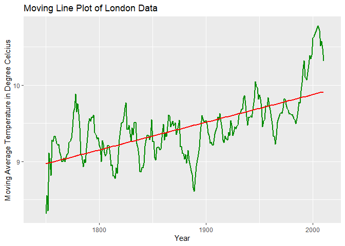
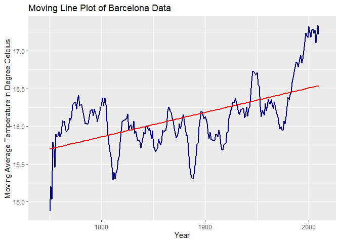
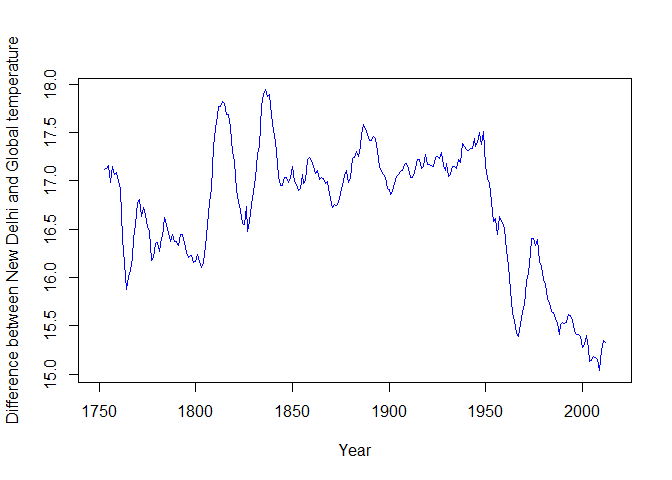

EXPLORING WEATHER DATA
=====================

Tool Used : R and Rmd
=====================

Getting the Data.
=================

Extract data from database
--------------------------

Download the global data as csv from the course site, using the command
below.

    SELECT * from global_data;

Cities data can be downloaded from the sql command below.

    SELECT * from city_data;

However, if we need the data for specific cities (New Delhi, London,
Barcelona and Berlin) we can provide where condition to the sql query.
Since there are two London and Barcelona in different countries we will
also specify country (United Kingdom and Spain).

    SELECT * from city_data 
    WHERE city = 'New Delhi' and country = 'India';

    SELECT * from city_data
    WHERE city = 'London' and country = 'United Kingdom';

    SELECT * from city_data 
    WHERE city = 'Barcelona' and country = 'Spain';

    SELECT * from city_data 
    WHERE city = 'Berlin' and country = 'Germany';

Install R packages needed in the project.
-----------------------------------------

``` r
library(ggplot2)
library(tseries)
```

    ## Registered S3 method overwritten by 'quantmod':
    ##   method            from
    ##   as.zoo.data.frame zoo

``` r
library(forecast)
```

Load both the global and city data
----------------------------------

``` r
city_data <- read.csv("city_data.csv", header = TRUE)
global_data <- read.csv("global_data.csv", header = TRUE)
```

Loading cities data (New Delhi, London, Barcelona and Berlin)
-------------------------------------------------------------

``` r
city_data_new_delhi <- subset(city_data, city_data$city == 'New Delhi' & city_data$country == 'India')
city_data_london <- subset(city_data, city_data$city == 'London' & city_data$country == 'United Kingdom')
city_data_barcelona <- subset(city_data, city_data$city == 'Barcelona' & city_data$country == 'Spain')
city_data_berlin <- subset(city_data, city_data$city == 'Berlin' & city_data$country == 'Germany')
```

Removing data with null values
------------------------------

``` r
city_data_new_delhi <- subset(city_data_new_delhi, !is.na(city_data_new_delhi$avg_temp))
city_data_london <- subset(city_data_london, !is.na(city_data_london$avg_temp))
city_data_barcelona <- subset(city_data_barcelona, !is.na(city_data_barcelona$avg_temp))
city_data_berlin <- subset(city_data_berlin, !is.na(city_data_berlin$avg_temp))
```

Taking only neccessary Data
---------------------------

``` r
city_data_new_delhi <- city_data_new_delhi[c("year", "avg_temp")]
city_data_london <- city_data_london[c("year", "avg_temp")]
city_data_barcelona <- city_data_barcelona[c("year", "avg_temp")]
city_data_berlin <- city_data_berlin[c("year", "avg_temp")]
```

The last 4 commands above are used to clean the city data by removing
the column that are not needed (the city name and country name).

Exploring the Data.
===================

Summary of Global Data
----------------------

``` r
summary(global_data)
```

    ##       year         avg_temp    
    ##  Min.   :1750   Min.   :5.780  
    ##  1st Qu.:1816   1st Qu.:8.082  
    ##  Median :1882   Median :8.375  
    ##  Mean   :1882   Mean   :8.369  
    ##  3rd Qu.:1949   3rd Qu.:8.707  
    ##  Max.   :2015   Max.   :9.830

Summary of New Delhi’s Data
---------------------------

``` r
summary(city_data_new_delhi)
```

    ##       year         avg_temp    
    ##  Min.   :1796   Min.   :23.70  
    ##  1st Qu.:1851   1st Qu.:24.80  
    ##  Median :1913   Median :25.14  
    ##  Mean   :1909   Mean   :25.17  
    ##  3rd Qu.:1963   3rd Qu.:25.55  
    ##  Max.   :2013   Max.   :26.71

Summary of Londons’s Data
-------------------------

``` r
summary(city_data_london)
```

    ##       year         avg_temp     
    ##  Min.   :1743   Min.   : 4.130  
    ##  1st Qu.:1814   1st Qu.: 9.040  
    ##  Median :1880   Median : 9.420  
    ##  Mean   :1880   Mean   : 9.436  
    ##  3rd Qu.:1946   3rd Qu.: 9.880  
    ##  Max.   :2013   Max.   :11.190

Summary of Barcelona’s Data
---------------------------

``` r
summary(city_data_barcelona)
```

    ##       year         avg_temp    
    ##  Min.   :1743   Min.   :10.78  
    ##  1st Qu.:1814   1st Qu.:15.83  
    ##  Median :1880   Median :16.09  
    ##  Mean   :1880   Mean   :16.12  
    ##  3rd Qu.:1946   3rd Qu.:16.47  
    ##  Max.   :2013   Max.   :17.90

Summary of Berlin’s Data
------------------------

``` r
summary(city_data_berlin)
```

    ##       year         avg_temp     
    ##  Min.   :1743   Min.   : 1.430  
    ##  1st Qu.:1814   1st Qu.: 8.350  
    ##  Median :1880   Median : 8.930  
    ##  Mean   :1880   Mean   : 8.885  
    ##  3rd Qu.:1946   3rd Qu.: 9.490  
    ##  Max.   :2013   Max.   :10.960

Now try to create a moving average plot of all data with size of 7.

#### Moving Average :

Moving averages are used to smooth out data to make it easier to observe
long term trends and not get lost in daily fluctuations.

**The moving average is calculated by adding data over a certain period
and dividing the sum by the total number of periods.**

### Formula for finding moving average :

``` r
m7 <- function(arr, n = 7){
  res = arr
  for(i in n:length(arr)){
    res[i] = mean(arr[(i-n):i])
  }
  res
}
```

**Another Way to find moving average is to : **

Create a repetition of 7 for taking moving average of 7 years and filter
avg\_temp with it. **(STACKOVERFLOW)**. Using this method as this is
faster than using self made function.

``` r
m7 <- rep(1/7,7)
```

Creating moving average temperature for global data
---------------------------------------------------

``` r
global_data$moving_avg_temp <- filter(global_data$avg_temp, m7, sides = 2)
```

Creating moving average temperature for all cities data
-------------------------------------------------------

``` r
city_data_new_delhi$moving_avg_temp <- filter(city_data_new_delhi$avg_temp, m7, sides=2)
city_data_london$moving_avg_temp <- filter(city_data_london$avg_temp, m7, sides=2)
city_data_barcelona$moving_avg_temp <- filter(city_data_barcelona$avg_temp, m7, sides=2)
city_data_berlin$moving_avg_temp <- filter(city_data_berlin$avg_temp, m7, sides=2)
```

Creating moving average plot for Global data
--------------------------------------------

``` r
head(global_data)
```

    ##   year avg_temp moving_avg_temp
    ## 1 1750     8.72              NA
    ## 2 1751     7.98              NA
    ## 3 1752     5.78              NA
    ## 4 1753     8.39        8.078571
    ## 5 1754     8.47        8.121429
    ## 6 1755     8.36        7.944286

``` r
gplot1 <- ggplot(data = global_data, aes(global_data$year, global_data$moving_avg_temp))
gplot1 <- gplot1 + geom_line(size = 1, col = "darkcyan") + labs(title = "Moving Line Plot of Global Data", x = "Year", y = "Moving Average Temperature in Degree Celcius")
gplot1 <- gplot1 + geom_smooth(method = "lm", se = FALSE, col = 'red')
gplot1
```

    ## Don't know how to automatically pick scale for object of type ts. Defaulting to continuous.

    ## `geom_smooth()` using formula 'y ~ x'


Creating moving average plot for New Delhi’s data
-------------------------------------------------

``` r
head(city_data_new_delhi)
```

    ##       year avg_temp moving_avg_temp
    ## 45695 1796    25.03              NA
    ## 45696 1797    26.71              NA
    ## 45697 1798    24.29              NA
    ## 45698 1799    25.28        25.19571
    ## 45699 1800    25.21        25.24571
    ## 45700 1801    24.22        25.09857

``` r
gplot2 <- ggplot(data = city_data_new_delhi, aes(city_data_new_delhi$year, city_data_new_delhi$moving_avg_temp))
gplot2 <- gplot2 + geom_line(size = 1, col = "orange4") + labs(title = "Moving Line Plot of New Delhi Data", x = "Year", y = "Moving Average Temperature in Degree Celcius")
gplot2 <- gplot2 + geom_smooth(method = "lm", se = FALSE, col = 'red')
gplot2
```

    ## Don't know how to automatically pick scale for object of type ts. Defaulting to continuous.

    ## `geom_smooth()` using formula 'y ~ x'


Creating moving average plot for new london’s data
--------------------------------------------------

``` r
head(city_data_london)
```

    ##       year avg_temp moving_avg_temp
    ## 36013 1743     7.54              NA
    ## 36014 1744    10.34              NA
    ## 36015 1745     4.13              NA
    ## 36020 1750    10.25        8.315714
    ## 36021 1751     9.99        8.552857
    ## 36022 1752     6.54        8.354286

``` r
gplot3 <- ggplot(data = city_data_london, aes(city_data_london$year, city_data_london$moving_avg_temp, color = "purple"))
gplot3 <- gplot3 + geom_line(size = 1, col = "green4") + labs(title = "Moving Line Plot of London Data", x = "Year", y = "Moving Average Temperature in Degree Celcius")
gplot3 <- gplot3 + geom_smooth(method = "lm", se = FALSE, col = 'red')
gplot3
```

    ## Don't know how to automatically pick scale for object of type ts. Defaulting to continuous.

    ## `geom_smooth()` using formula 'y ~ x'



Creating moving average plot for new Barcelona’s data
-----------------------------------------------------

``` r
head(city_data_barcelona)
```

    ##      year avg_temp moving_avg_temp
    ## 6942 1743    13.81              NA
    ## 6943 1744    16.98              NA
    ## 6944 1745    10.78              NA
    ## 6949 1750    16.52        14.87571
    ## 6950 1751    16.78        15.20143
    ## 6951 1752    13.09        15.03286

``` r
gplot4 <- ggplot(data = city_data_barcelona, aes(city_data_barcelona$year, city_data_barcelona$moving_avg_temp))
gplot4 <- gplot4 + geom_line(size = 1, col = "darkblue") + labs(title = "Moving Line Plot of Barcelona Data", x = "Year", y = "Moving Average Temperature in Degree Celcius")
gplot4 <- gplot4 + geom_smooth(method = "lm", se = FALSE, col = 'red')
gplot4
```

    ## Don't know how to automatically pick scale for object of type ts. Defaulting to continuous.

    ## `geom_smooth()` using formula 'y ~ x'



Creating moving average plot for berlin’s data
----------------------------------------------

``` r
head(city_data_berlin)
```

    ##      year avg_temp moving_avg_temp
    ## 8991 1743     6.33              NA
    ## 8992 1744    10.36              NA
    ## 8993 1745     1.43              NA
    ## 8998 1750     9.83        7.322857
    ## 8999 1751     9.75        7.631429
    ## 9000 1752     4.84        7.331429

``` r
gplot5 <- ggplot(data = city_data_berlin, aes(city_data_berlin$year, city_data_berlin$moving_avg_temp))
gplot5 <- gplot5 + geom_line(size = 1, col = "purple3") + labs(title = "Moving Line Plot of Berlin Data", x = "Year", y = "Moving Average Temperature in Degree Celcius")
gplot5 <- gplot5 + geom_smooth(method = "lm", se = FALSE, col = 'red')
gplot5
```

    ## Don't know how to automatically pick scale for object of type ts. Defaulting to continuous.

    ## `geom_smooth()` using formula 'y ~ x'


Observations
============

As we can see from above, cities and global temperature has tendency to
increase throughout the year.

**My City (New Delhi) is hotter than any other countries in analysis but
this is because it lies in tropical area.**

Is the increase the same for city and global?
---------------------------------------------

Lets calculate the difference between cities temperature Data and global
Data.

``` r
diff1 <- city_data_new_delhi$avg_temp - global_data$avg_temp
diff2 <- city_data_london$avg_temp - global_data$avg_temp
diff3 <- city_data_barcelona$avg_temp - global_data$avg_temp
diff4 <- city_data_berlin$avg_temp - global_data$avg_temp
```

Differnce between average temperatures of Global and New Delhi.

``` r
summary(diff1)
```

    ##    Min. 1st Qu.  Median    Mean 3rd Qu.    Max. 
    ##   14.33   16.13   16.77   16.70   17.29   18.94

Differnce between average temperatures of Global and London.

``` r
summary(diff2)
```

    ##    Min. 1st Qu.  Median    Mean 3rd Qu.    Max. 
    ##  -1.820   0.670   1.040   1.065   1.455   3.210

Differnce between average temperatures of Global and Barcelona.

``` r
summary(diff3)
```

    ##    Min. 1st Qu.  Median    Mean 3rd Qu.    Max. 
    ##   4.730   7.380   7.760   7.745   8.125   9.410

Differnce between average temperatures of Global and Berlin.

``` r
summary(diff4)
```

    ##    Min. 1st Qu.  Median    Mean 3rd Qu.    Max. 
    ## -4.3500  0.0750  0.5500  0.5146  1.1550  3.0200

**From above summary, we can conclude that there’s is a high mean
difference between global data and New Delhi (16 degrees) and a minor
difference between barcelona and global data. However, there’s almost 0
difference between the temperatures at london and berlin.**

**This suggests that cities with warm weather are getting hotter while
the cities with cool weather has no great change meaning they are
increasing consistently with global temperatures but temperatures at
warmer cities (New Delhi and Barcelona) are increasing faster than
global temperature.**

New Delhi and Global Data
-------------------------

Plotting the data of New Delhi and Global, it should be a nearly
straight line if the increase is the same.

``` r
plot(global_data$year, diff1, type="l", xlab="Year", ylab="Difference between New Delhi and Global temperature", col = 'blue')
```


**From the plot above, it is hard to tell whether the data is actually
increasing or decreasing between years 1750 to 1950. However we can see
that the difference lies around 16 degrees each year and trend is
continuosly decreasing after the year 1950.**

Let’s try to smoothen the data using moving average to visualize the
differences better.

``` r
diff_moving_avg_temp <- filter(diff1, m7, sides=2)
plot(global_data$year, diff_moving_avg_temp, type="l", xlab="Year", ylab="Difference between New Delhi and Global temperature",col = 'blue')
```



**From here, we can see that in the last few decades, the difference has
tendency to decrease.**

It means global temperature has increased by more than city’s since the
difference is becoming smaller.

Does global temperature increase faster than city temperature?
--------------------------------------------------------------

We will be using difference of 10 years between temperatures to compare
the temperature of the year with the temperature 10 years ago and
compare trend of global data with cities data.

``` r
plot(diff(global_data$avg_temp, differences= 10), type="l", col = "blue", lwd = 3, xlab = "", ylab = "")
lines(diff(city_data_new_delhi$avg_temp, differences=10), col="red", lwd = 3)
```


**The red plot marks the new delhi’s temperature difference, which is
similar to the global temperature. Thus, we can roughly conclude that
global temperature increase as same pace as the city temperature.**

``` r
plot(diff(global_data$avg_temp, differences= 10), type="l", col = "blue", lwd = 3, xlab = "", ylab = "")
lines(diff(city_data_london$avg_temp, differences=10), col="red", lwd = 3)
```


**The red plot marks the london’s temperature difference, which is
higher to the global temperature. Thus, we can roughly conclude that
london’s temperature is increasing faster than global temperature.**

``` r
plot(diff(global_data$avg_temp, differences= 10), type="l", col = "blue", lwd = 3, xlab = "", ylab = "")
lines(diff(city_data_barcelona$avg_temp, differences=10), col="red", lwd = 3)
```


**The red plot marks the barcelona’s temperature difference, which is
similar to the global temperature. Thus, we can roughly conclude that
barcelona’s temperature is increasing at same rate as the global
temperature.**

``` r
plot(diff(global_data$avg_temp, differences= 10), type="l", col = "blue", lwd = 3, xlab = "", ylab = "")
lines(diff(city_data_berlin$avg_temp, differences=10), col="red", lwd = 3)
```


**The red plot marks the berlin’s temperature difference, which is a lot
higher to the global temperature. Thus, we can roughly conclude that
berlin’s temperature is increasing at a lot faster than the global
temperature.**

To conclude, there is a clear overall uptrend visible, what means, that the average global temperature is increasing, with an also increasing tempo.
====================================================================================================================================================

The cities New Delhi(India), Berlin(Germany), London(United Kingdom) and
Barcelona(Spain) got compared to the global data.

### Clearly, Global temperatures are increasing with similar trend to other cities.

**Looking at the difference between temperatures of New Delhi and Global
Data, it is almost 16 and constant for a long peroid but decreases after
1950 which means the global temperature is increasing at higher pace as
there’s a sharp decline in difference.**

**Barcelona and New Delhi has almost same maximum and mean temperatures
but there is a lot of difference between there minimum temperatures as
they both are at the same tropical zone, suggesting barcelona has almost
similar temperature.**
